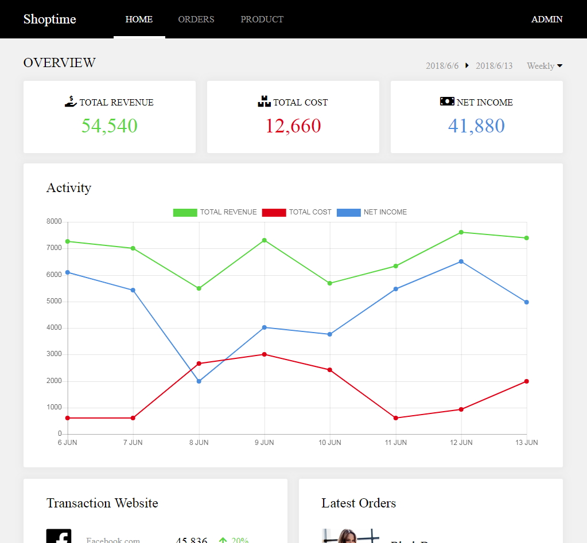

## 【練習作品】訂單管理系統 (admin order)
***
### 練習主題：版型練習、canvas繪圖
### 技術：html + CSS + JSON資料 + canvas繪圖
### 頁面展示：<https://zshao1031.github.io/TheF2E-Week-3/>
### 未實作功能：純粹是版型，沒有功能

***
## 【其他說明】
### The F2E 活動：這是由《六角學院》所舉辦的練功活動，每週出一主題(附設計稿)給參加者練習，參與者可自行決定實作到什麼程度，但至少要挑一頁版型來製作。

### 設計稿：https://hexschool.github.io/THE_F2E_Design/week3-admin%20order/?fbclid=IwAR0qh0peR10L3WxrF_3XpDFLDnsyFBg2Jj4mmv5qWkPtEm7Fgv5UhMeUTPA
